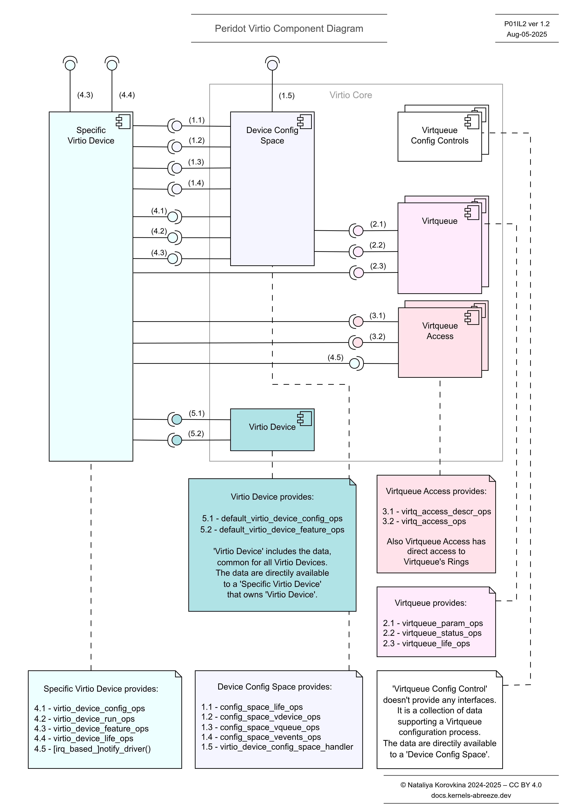

# Peridot Virtio

(**P01** Ver 1.1. August 2025)

“Peridot Virtio” is a Software Architecture, a model of Virtio functionality from standpoint of Devices support (Virtio backend).

## Scope of the Architecture

The Architecture introduces Virtio Core - set of classes that allow a specific Virtio device to interact with Virtqueues and Device Config Space.

It specifies interfaces between:
(1) Virtio Core and a Device
(2) Virtio Core and Dispatching Components
(3) a Device and other Peridot components

Complete introduction to the Architecture locates in "Peridot Virtio Architecture Presentation"

## Components of Virtio Core

In this project, "component" is an instantiation of a class.

**Peridot Virtio Core classes:**

* 'Device Config Space'

* 'Virtqueue'

* 'Virtqueue Access'

* 'Virtqueue Config Controls'

* 'Virtio Device'

 

Peridot Virtio component diagram below describes interfaces defined by Peridot Virtio,
using an example of a specific Virtio device with two Virtqueues.

### Naming conventions

**'Device Config Space'** 
Short: 'Config Space' 
In code: dev-config-space 
Structure name: device\_config\_space

**'Virtqueue'** 
Short 'Virtq' 
In code: virtq 
Structure name: virtqueue

**'Virtqueue Access'** 
Short 'Virtq Access' 
In code: virtq-access 
Structure name: virtq\_access

**'Virtqueue Config Controls'** 
Short 'Vq Controls' 
In code: vq-config-controls 
Structure name: virtq\_config\_controls

**'Virtio Device'** 
Short: the same 
In code: virtio-device 
Structure name: virtio\_device

**'Specific Virtio Device'** 
Short 'Spec Virtio Device' 
In code: spec-virtio-device

In documentation, the short and full names of the components are single quoted.

